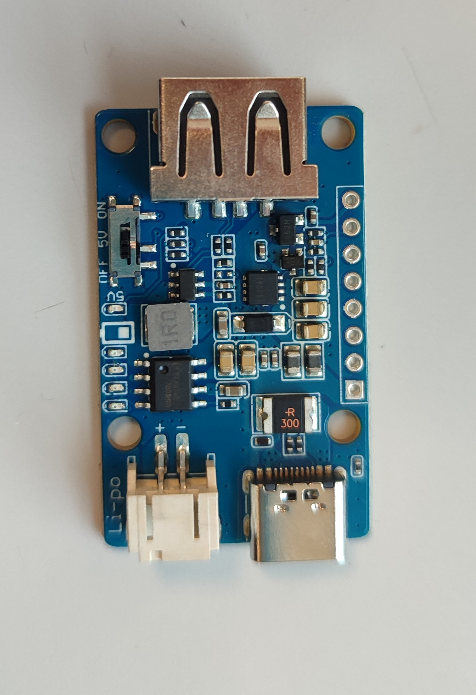
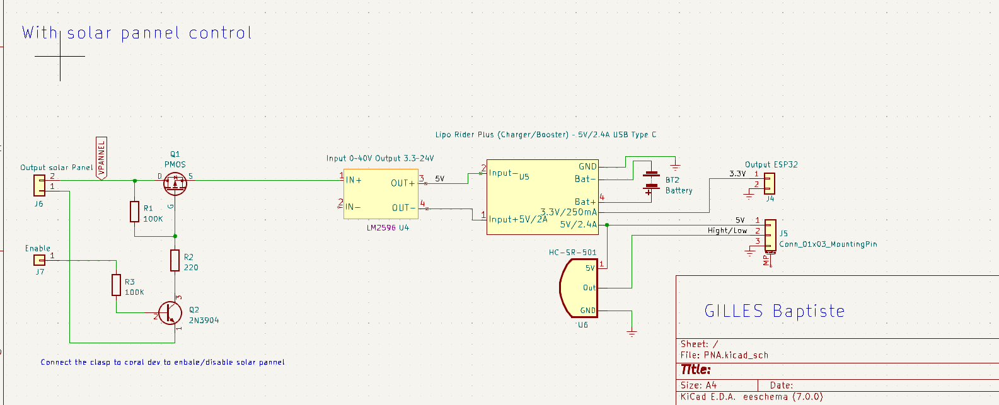
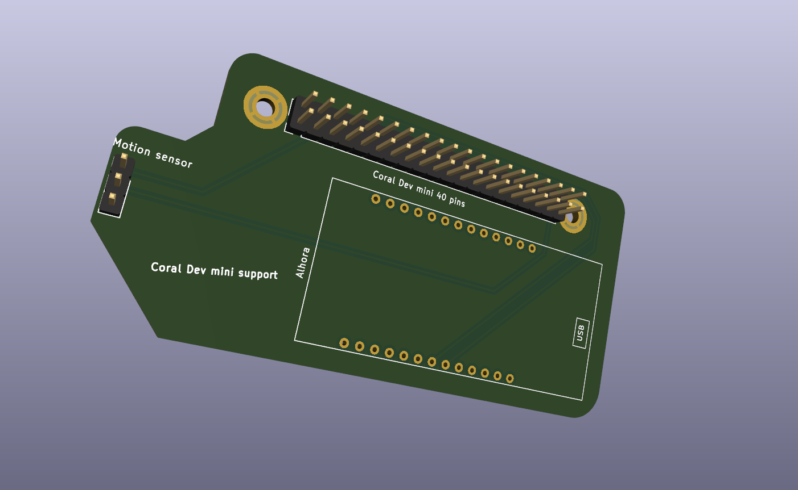
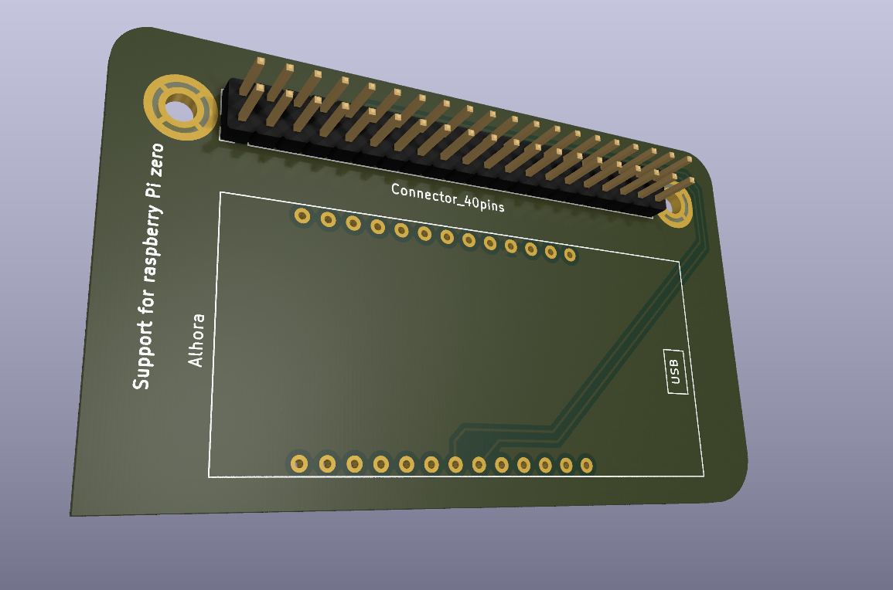

# Electric/Support 
In this section, I will present the electrical schematics and provide support for assembling the final prototype. I will explain the different components that are being used.

## Components choices
1. **Consumption Report**

    | Components      | Max curent      | Current mAh  
    |---    |:-:    |:-:    |
    | Coral dev mini   |   1.8A    |  1.3Ah     |    
    | Charger |      0 |    0   |  
    | Convertor|   ~0.1uA    |    ~0   |      
    | Motion sensor HC-SR501/602|   65mA/20uA    |    65mAh/20uAh   | 
    | Esp32|   250mA    |  33mAh     |   
    |Total ||1398mAh

    For more detail check  [PNAlistofcomponents](PNAlistofcomponents.xlsx).

2. **Lipo Rider Plus (Charger/Booster) ‐ 5V/2.4A USB Type C**

    

    This charger can charge a battery with a maximum current of 2A, which is sufficient to charge the battery faster than its discharge rate (2A > 1.4A).

    Output :

    -> 5V 2,4A with USB A perfect for powering up the Coral Dev Mini

    -> 3.3V 250mA used to powerup the Esp32

    Input :

    Li-po 3.7V to plug the batterie
    Input 5V 2A Ideal for solar panel usage. If you are using a 12V solar panel, you will need to decrease the voltage using a converter.

    [Convertor LM2596](https://www.farnell.com/datasheets/3740626.pdf)
---
3. **Motion sensor HCSR-501/602**

    You have two choice first the [501](https://www.amazon.es/Ociodual-HCSR501-Movimiento-HC-SR501-Detector/dp/B071FBG4XW) you can adjust  delay and sensibylity of the sensor but work current is about 65mAh  which may be high for embedded systems.

    Secondly you can use the [602](https://www.amazon.com/-/es/MH-SR602-movimiento-Piroel%C3%A9ctrico-Infrarrojos-Interruptor/dp/B07Z45RMZV) he is samller than the other , moreover he consum 20uA who is enought for embeded system but ! you can't adjust delay and sensybility. [The datasheets for both sensors provide more detailed information.](https://www.sinoning.com/hc-sr602-datasheet/) 

---
4. **Solar Panel**

    Specification of [solar pannel](https://www.amazon.es/dp/B076B3Z48G/ref=twister_B07V383T1X?_encoding=UTF8&psc=1) :

        12V -> We need to decrease the voltage thank to a convertor.
        2.83A -> short circuit current (Mot important detail when you choice solar pannel) we need to decrease the current with a resistor because the charge accept 2A input.

 ---
5. **Batterie**

    Two importants things :

    First : Charge current can't exceed C/2 for exemple if you use a 1000mAh batterie, the charge current should be limited to 500mA.

    Second : The battery's capacity should be chosen based on the desired operating time of the system. For example, if the system consumes 200mAh and a battery with a capacity of 1000mAh (C=1000mAh) is used, it can operate for approximately 5 hours (C/200).
    [The provided battery is a 3.7V LiPo battery with a specific model and specifications.](https://www.amazon.es/Seamuing-recargable-protectora-revestimiento-aislamiento/dp/B0953L98RK/ref=asc_df_B0953L98RK/?tag=googshopes-21&linkCode=df0&hvadid=529719986347&hvpos=&hvnetw=g&hvrand=11114344516094827305&hvpone=&hvptwo=&hvqmt=&hvdev=c&hvdvcmdl=&hvlocint=&hvlocphy=1005424&hvtargid=pla-1364883397183&psc=1)

---

6. **Shematic**

    

## Support
1. **Coral dev support for Esp32**

2. **Pi zero support**

